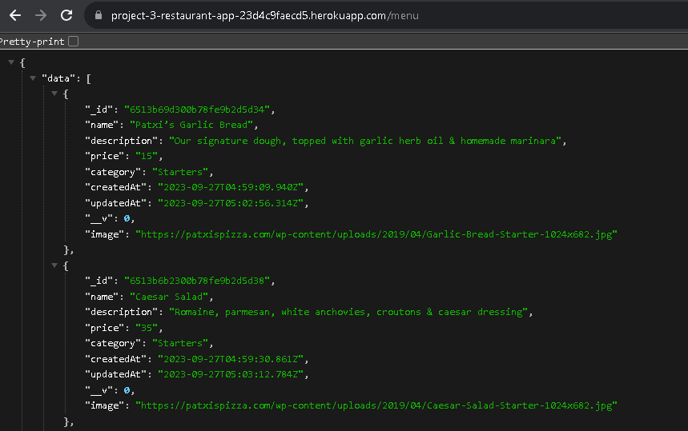
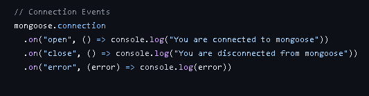

# project-3-restaurant-app-backend
This restaurant web application makes it easy for restaurant owner to create and update their restaurant profiles and menus to showcase delicious food and connect with customers.
### Screenshots
##### Data!

##### Mongoose

## Technologies Used
- MongoDB/Mongoose (Backend)
- Express (Backend)
= Heroku(Deployment)
- React (Frontend)
- Node(Frontend)

## Getting Started
To access the deployed version of our backend restaurant application, please click on the following link: [Backend Restaurant Application](https://project-3-restaurant-app-23d4c9faecd5.herokuapp.com/)

For backend, will need /restaurant or /menu after the url to see any data

Also check out our Trello where production was organized! : [Trello Management](https://trello.com/invite/b/EFES3mM3/ATTIa40ee1d9aab22a2fdf6e751634c82bb6AC4FF904/restaurant-project-3)

## Next Steps
- Owner Authentication, this system ensures that only the owner can sign in and access or update their restaurant's information.
- Create a gallery page to display pictures of restaurant's food and ambiance.
- Improve the website design to make it more enjoyable for users.
- Add menu sections like 'Starters', 'Salads', 'Main Courses', 'Kids Menu', 'Desserts' and 'Beverages' to make it easier for customers to find what they want on the menu.

Your contributions and ideas are always welcome!